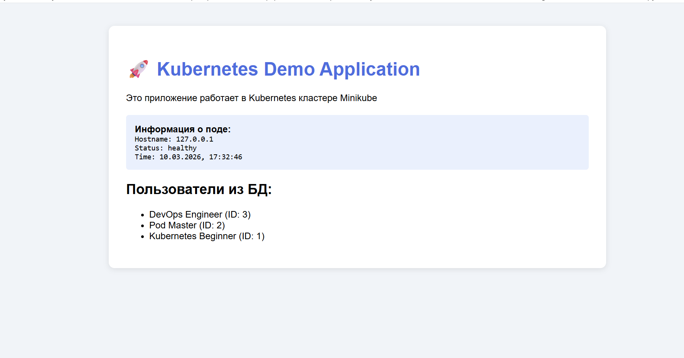
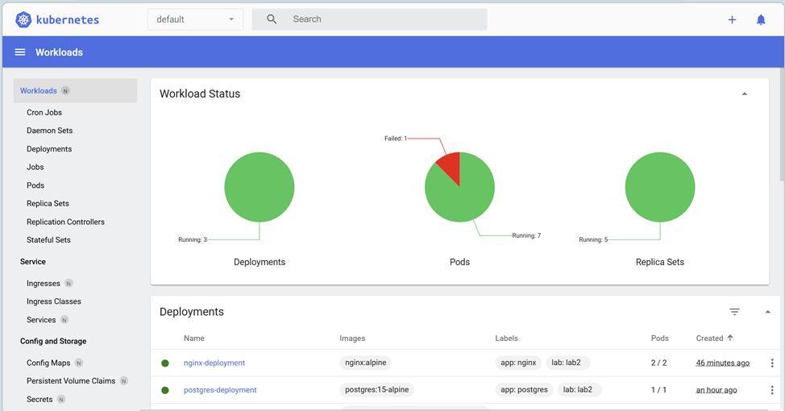
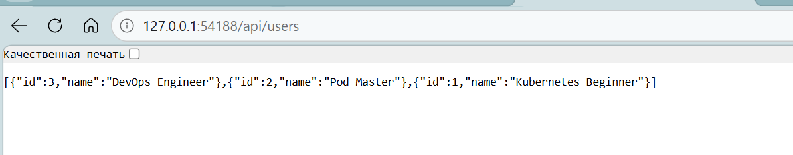
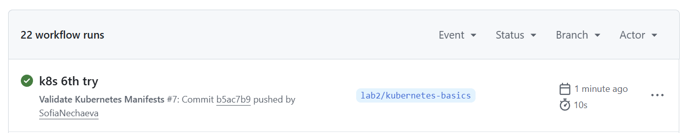

# Отчет по практической работе №2
## Студент: Нечаева Софья
## Группа: БСБО-16-23
## Дата выполнения: 10.03
### 1. Информация о кластере
#### 1.1 Статус Minikube
\`\`\`
[вставьте вывод minikube status]
\`\`\`
#### 1.2 Узлы кластера
\`\`\`
[вставьте вывод kubectl get nodes -o wide]
\`\`\`
### 2. Созданные ресурсы
#### 2.1 Pods
\`\`\`
[вставьте вывод kubectl get pods -o wide]
\`\`\`
#### 2.2 Deployments
\`\`\`
[вставьте вывод kubectl get deployments]
\`\`\`
#### 2.3 Services
\`\`\`
[вставьте вывод kubectl get services]
\`\`\`

### 3. Скриншоты работы приложения
#### 3.1 Главная страница

#### 3.2 Дашборд Kubernetes

#### 3.3 Результат GET /api/users

### 4. Эксперименты с масштабированием
#### 4.1 Масштабирование до 5 реплик
\`\`\`
[команда и вывод kubectl scale]
\`\`\`
#### 4.2 Проверка распределения нагрузки
\`\`\`
[логи nginx с разных подов]
\`\`\`
### 5. GitHub Actions
#### 5.1 Успешная валидация манифестов

### 6. Ответы на контрольные вопросы
1. В чем разница между Pod и Deployment?
2. Для чего нужен Service типа ClusterIP?
3. Как ReplicaSet обеспечивает самовосстановление?
4. Что произойдет с приложением, если удалить под PostgreSQL?
### 7. Выводы
[Опишите, что нового узнали, с какими трудностями столкнулись]