# Отчет по практической работе №2
## Студент: Нечаева Софья
## Группа: БСБО-16-23
## Дата выполнения: 10.03
### 1. Информация о кластере
#### 1.1 Статус Minikube

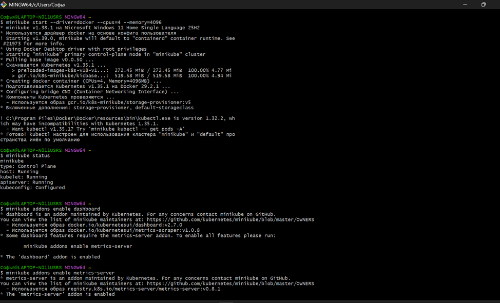

#### 1.2 Узлы кластера
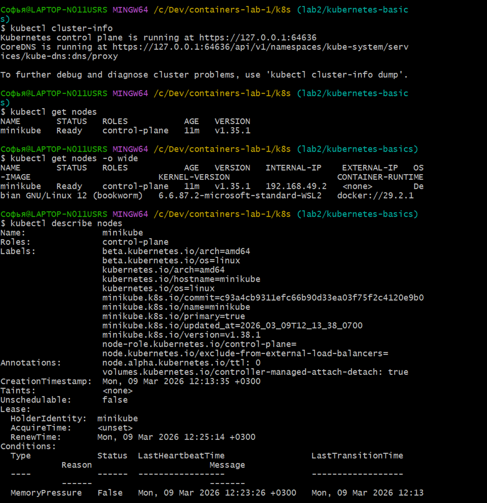

Самостоятельное задание: Сохраните вывод команды kubectl get nodes -o wide в файл nodes.txt и
включите его в отчет

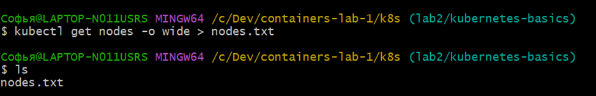
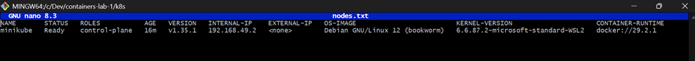

### 2. Созданные ресурсы
#### 2.1 Pods
Задание 2.2.1: Работа с подом

##### Применение манифеста
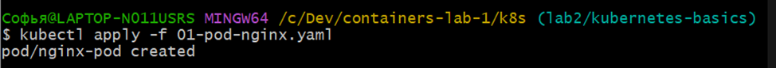

##### Просмотр подов
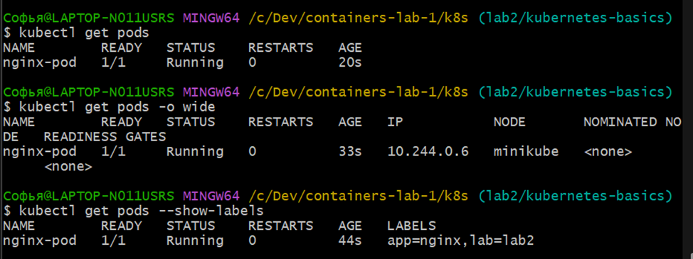

##### Самостоятельное задание. 
Создайте под с вашим Go-приложением из ЛР1 (образ из GHCR). Убедитесь, что он запускается, но обратите внимание, что без базы данных он будет падать с ошибкой. Сохраните логи упавшего пода в файл crash-logs.txt

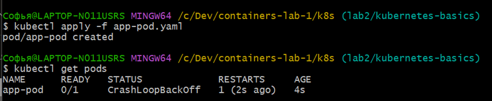
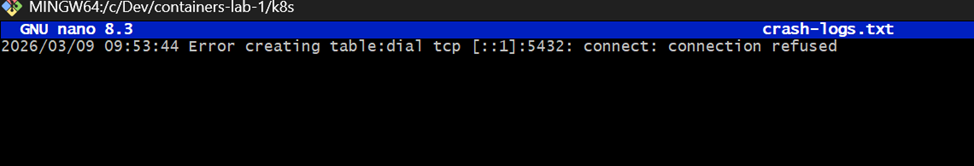

#### 2.2 Deployments

##### Применение манифеста и Просмотр Deployment

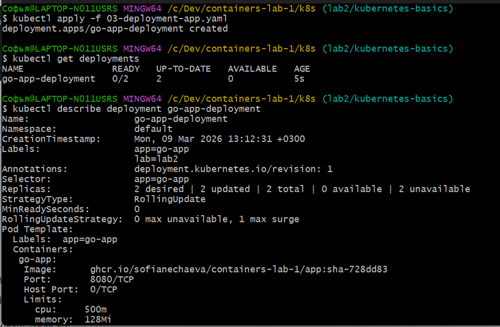

##### Просмотр созданного ReplicaSet и Просмотр подов
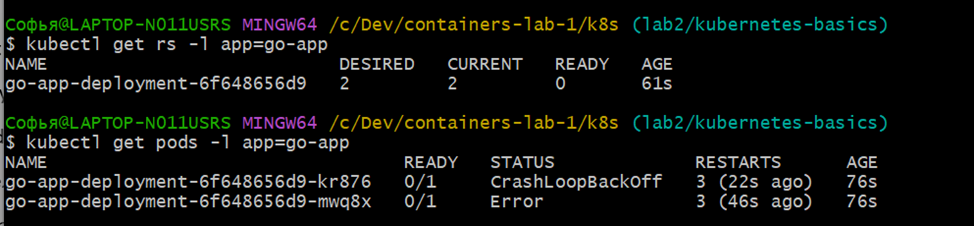

##### Просмотр истории обновлений
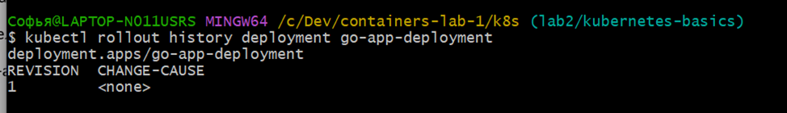

##### Самостоятельное задание

1. Создайте Deployment для PostgreSQL (используйте официальный образ)
2. Убедитесь, что поды PostgreSQL и Go-App запускаются
3. Проверьте логи Go-App — он должен пытаться подключиться к PostgreSQL, но не сможет, так как
сервиса еще нет

Софья@LAPTOP-N011USRS MINGW64 /c/Dev/containers-lab-1/k8s (lab2/kubernetes-basics)
$ kubectl apply -f postgres-deployment.yaml
deployment.apps/postgres-deployment created

Софья@LAPTOP-N011USRS MINGW64 /c/Dev/containers-lab-1/k8s (lab2/kubernetes-basics)
$ kubectl get pods
NAME                                   READY   STATUS              RESTARTS        AGE
app-pod                                0/1     CrashLoopBackOff    11 (77s ago)    32m
go-app-deployment-6f648656d9-kr876     0/1     CrashLoopBackOff    7 (105s ago)    12m
go-app-deployment-6f648656d9-mwq8x     0/1     CrashLoopBackOff    7 (81s ago)     12m
go-app-deployment-6f648656d9-x76b5     0/1     CrashLoopBackOff    6 (3m53s ago)   9m58s
nginx-replicaset-bjpvc                 1/1     Running             0               18m
nginx-replicaset-dnlnd                 1/1     Running             0               20m
nginx-replicaset-j9sc5                 1/1     Running             0               22m
nginx-replicaset-l5dtq                 1/1     Running             0               22m
nginx-replicaset-xl9gv                 1/1     Running             0               20m
postgres-deployment-575f6fcc89-tkxg6   0/1     ContainerCreating   0               18s

Софья@LAPTOP-N011USRS MINGW64 /c/Dev/containers-lab-1/k8s (lab2/kubernetes-basics)
$ kubectl get pods
NAME                                   READY   STATUS             RESTARTS        AGE
app-pod                                0/1     CrashLoopBackOff   11 (2m1s ago)   32m
go-app-deployment-6f648656d9-kr876     0/1     CrashLoopBackOff   7 (2m29s ago)   13m
go-app-deployment-6f648656d9-mwq8x     0/1     CrashLoopBackOff   7 (2m5s ago)    13m
go-app-deployment-6f648656d9-x76b5     0/1     CrashLoopBackOff   6 (4m37s ago)   10m
nginx-replicaset-bjpvc                 1/1     Running            0               19m
nginx-replicaset-dnlnd                 1/1     Running            0               20m
nginx-replicaset-j9sc5                 1/1     Running            0               23m
nginx-replicaset-l5dtq                 1/1     Running            0               23m
nginx-replicaset-xl9gv                 1/1     Running            0               20m
postgres-deployment-575f6fcc89-tkxg6   1/1     Running            0               62s

Софья@LAPTOP-N011USRS MINGW64 /c/Dev/containers-lab-1/k8s (lab2/kubernetes-basics)
$ kubectl get pods
NAME                                   READY   STATUS             RESTARTS         AGE
app-pod                                0/1     CrashLoopBackOff   11 (3m13s ago)   34m
go-app-deployment-6f648656d9-kr876     0/1     CrashLoopBackOff   7 (3m41s ago)    14m
go-app-deployment-6f648656d9-mwq8x     0/1     CrashLoopBackOff   7 (3m17s ago)    14m
go-app-deployment-6f648656d9-x76b5     0/1     CrashLoopBackOff   7 (30s ago)      11m
nginx-replicaset-bjpvc                 1/1     Running            0                20m
nginx-replicaset-dnlnd                 1/1     Running            0                22m
nginx-replicaset-j9sc5                 1/1     Running            0                24m
nginx-replicaset-l5dtq                 1/1     Running            0                24m
nginx-replicaset-xl9gv                 1/1     Running            0                22m
postgres-deployment-575f6fcc89-tkxg6   1/1     Running            0                2m14s

Софья@LAPTOP-N011USRS MINGW64 /c/Dev/containers-lab-1/k8s (lab2/kubernetes-basics)
$ kubectl logs -l app=go-app
2026/03/09 10:23:30 Error creating table:dial tcp: lookup postgres-service on 10.96.0.10:53: server misbehaving
2026/03/09 10:23:54 Error creating table:dial tcp: lookup postgres-service on 10.96.0.10:53: server misbehaving
2026/03/09 10:26:41 Error creating table:dial tcp: lookup postgres-service on 10.96.0.10:53: server misbehaving

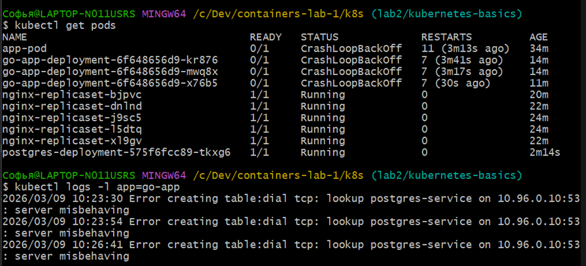
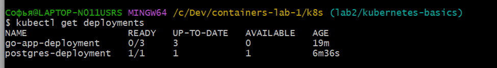

#### 2.3 Services

##### Создание сервисов и  Просмотр сервисов
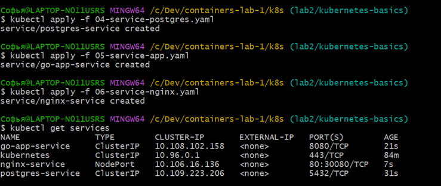

##### Детальная информация
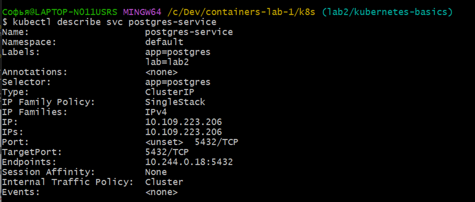

##### Проверка DNS-резолвинга внутри кластера
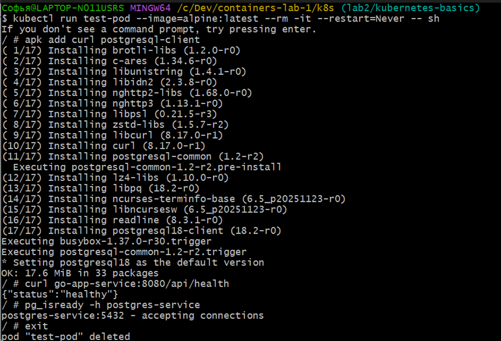

### Задание 3.1.1: Проверка синтаксиса и валидация
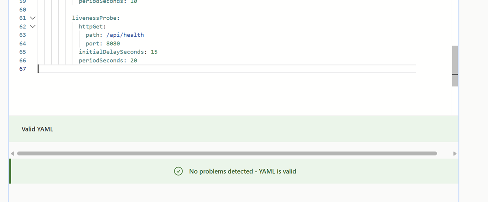

##### Сухая проверка (dry-run) в Kubernetes
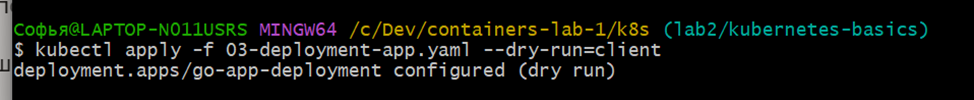

##### Получение объяснения по полям
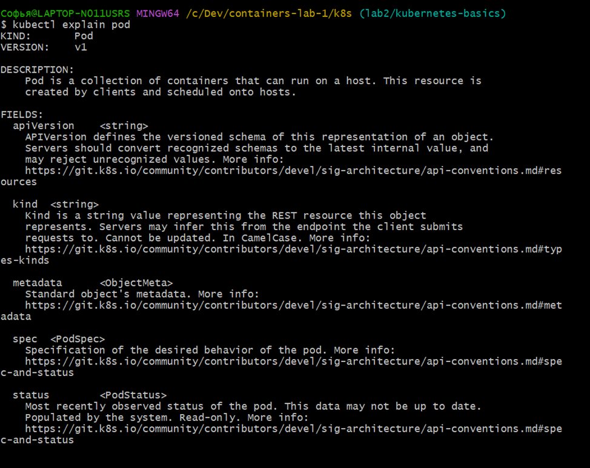

##### Валидация с помощью kubeval
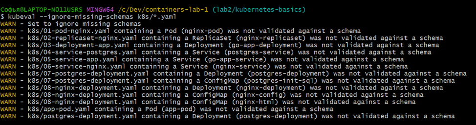

### 3.2 Отладка приложений
#### Задание 3.2.1: Диагностика проблем

##### Просмотр событий в кластере
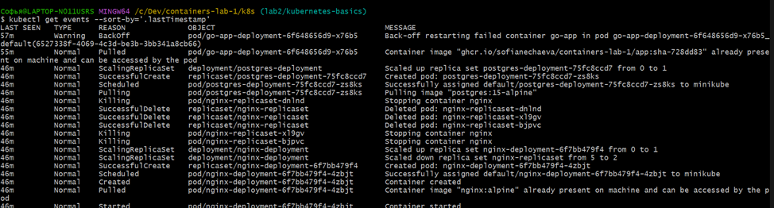 

##### Просмотр логов конкретного пода
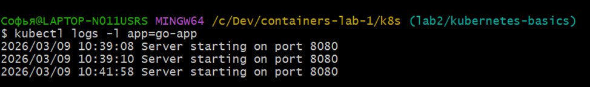
 
##### Порт-форвардинг для доступа к приложению без Service
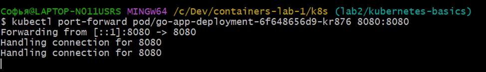

##### Интерактивная отладка - запуск временного пода в той же сети
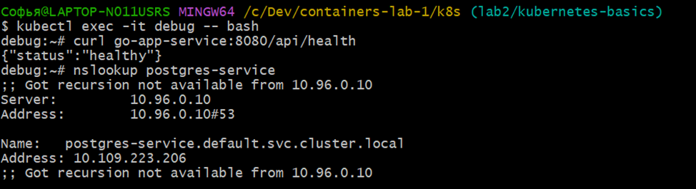

### 3. Скриншоты работы приложения
#### 3.1 Главная страница

#### 3.2 Дашборд Kubernetes

#### 3.3 Результат GET /api/users

### 4. Эксперименты с масштабированием
#### 4.1 Масштабирование до 5 реплик
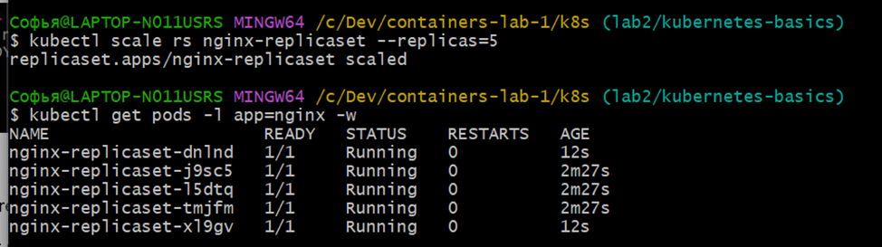

##### Эксперимент с самовосстановлением. Удалите один под и посмотрите, что произойдет
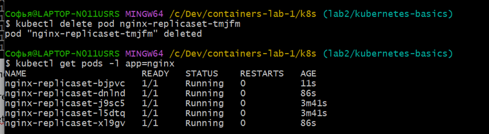

#### 4.2 Проверка распределения нагрузки

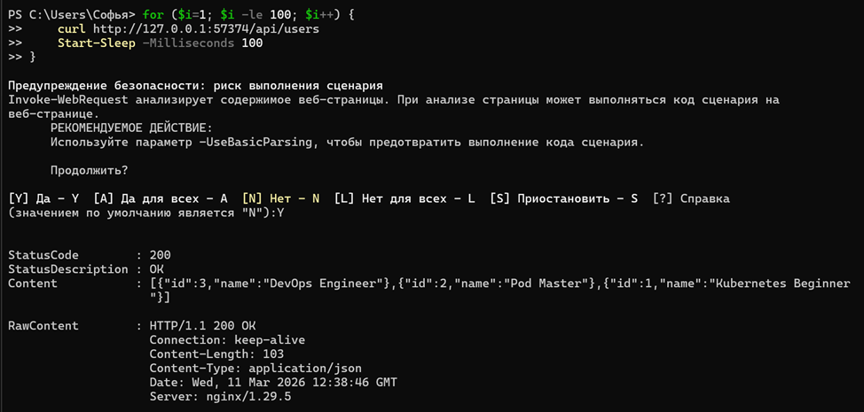

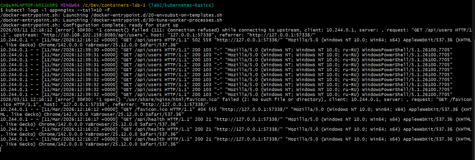

### 5. GitHub Actions
#### 5.1 Успешная валидация манифестов

### 6. Ответы на контрольные вопросы

1. В чем разница между Pod и Deployment?
   
    Pod - элемент минимальный, с контейнерами, не восстанавливаемыми автоматически. Deployment - это элемент контроля над подами. Контроллер который следит за количеством подов и реплик, обновлениями, откатами.

2. Для чего нужен Service типа ClusterIP?
    ClusterIP - это внутренний IP адрес для общения сервисов между собой. Нужен для точки доступа к подам, ведь их имена могут меняться

3. Как ReplicaSet обеспечивает самовосстановление?
   ReplicaSet постоянно сравнивает желаемое (указаное в манифесте) и фактическое состояние, получаемое им от Api-server. Если Pod исчезает — ReplicaSet получает событие, запускает контейнеры по шаблону.

4. Что произойдет с приложением, если удалить под PostgreSQL?
    Deployment автоматически создаст новый Pod PostgreSQL.Приложение временно потеряет доступ к базе, пока Pod пересоздаётся. После восстановления приложение продолжит работу ( если Empty Dir то данные пропадут и бд инициализируется заново)

### 7. Выводы
    Последовательно разобралась с элементами kubernetes 
    Pod --> ReplicaSet --> Deployment --> Service.
    На практике увидела, как kubernetes пересоздаёт пропавшие элементы 
    и обеспечивает отказоустойчивость, возможности отладки. Преодалела 
    непонимание  особенности раьоты временного хранилища (emptyDir)
