# Отчет по практической работе №3
## Студент: Нечаева Софья
## Группа: БСБО-16-23
## Дата выполнения: 24.04

### 1. Подготовка узлов
#### 1.1 Версия ОС и настройки

[вывод команды cat /etc/os-release с master-узла]
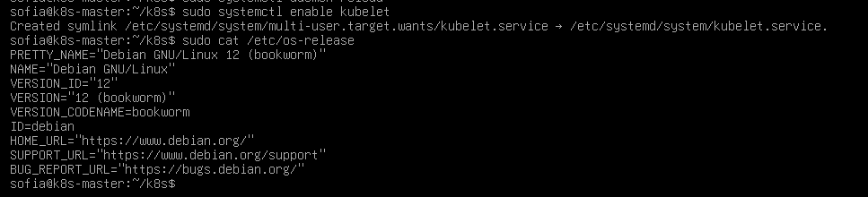

#### 1.2 Отключение swap

[вывод команды free -m]

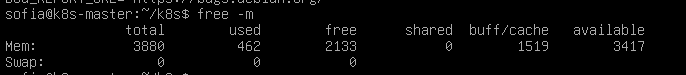

#### 1.3 Модули ядра

[вывод команды lsmod | grep -E "overlay|br_netfilter"]

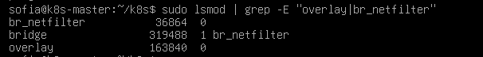

### 2. Установка containerd
#### 2.1 Версия containerd

[вывод команды containerd --version]

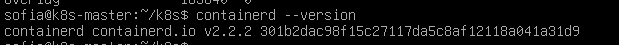

#### 2.2 Конфигурация containerd

[вставьте содержимое /etc/containerd/config.toml (только секцию с SystemdCgroup)]

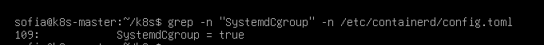
### 3. Установка kubeadm
#### 3.1 Версии компонентов

[вывод команды kubeadm version, kubelet --version, kubectl version --client]

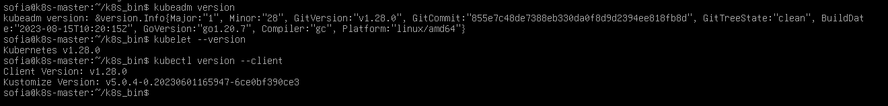

### 4. Инициализация кластера
#### 4.1 Узлы кластера

[вывод команды kubectl get nodes -o wide]

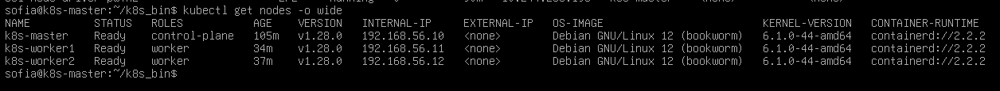

#### 4.2 Поды в namespace kube-system

[вывод команды kubectl get pods -n kube-system]

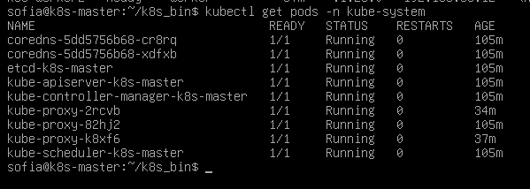

### 5. Сетевые компоненты
#### 5.1 Calico

[вывод команды kubectl get pods -n calico-system]

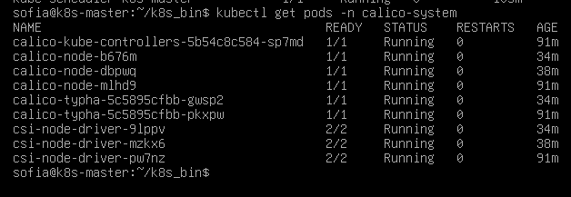

#### 5.2 MetalLB
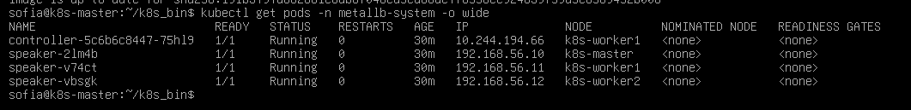

[вывод команды kubectl get pods -n metallb-system]

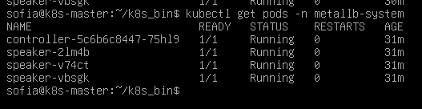

[вывод команды kubectl get ipaddresspools -n metallb-system]

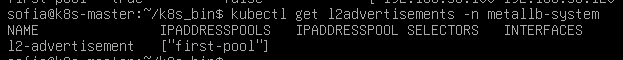

#### 5.3 Ingress Controller

[вывод команды kubectl get pods -n ingress-nginx]
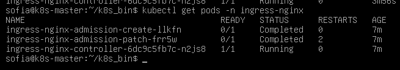

[вывод команды kubectl get svc -n ingress-nginx]
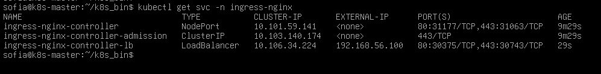

### 6. Развернутое приложение
#### 6.1 Все ресурсы в namespace lab3-app

[вывод команды kubectl get all -n lab3-app]
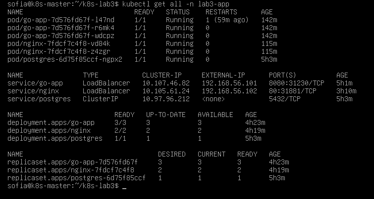

#### 6.2 PersistentVolumeClaim

[вывод команды kubectl get pvc -n lab3-app]
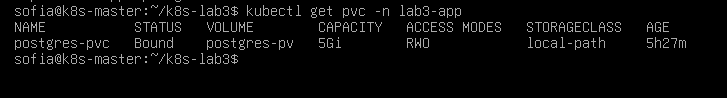

### 7. Скриншоты
#### 7.1 Главная страница приложения
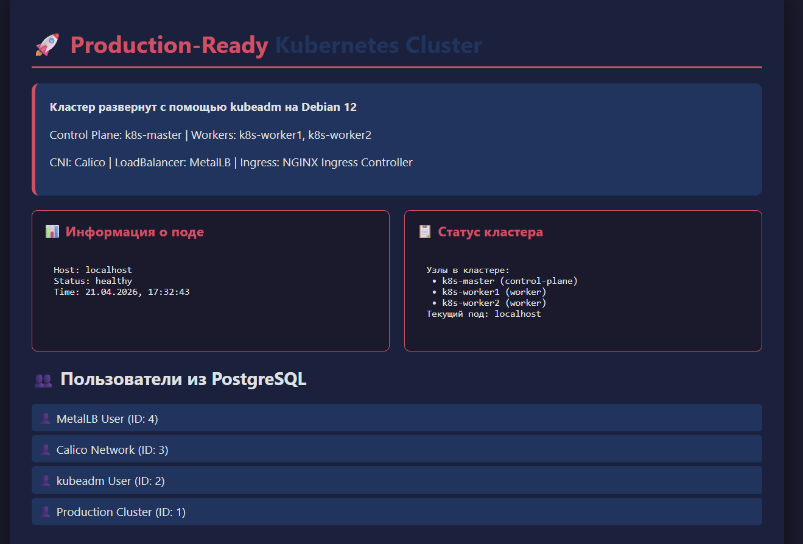

#### 7.2 Дашборд с информацией о поде

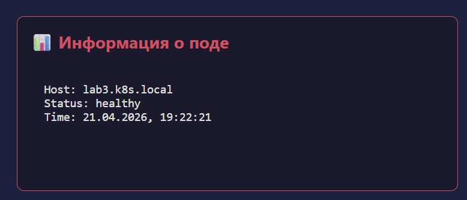

#### 7.3 Список пользователей из БД

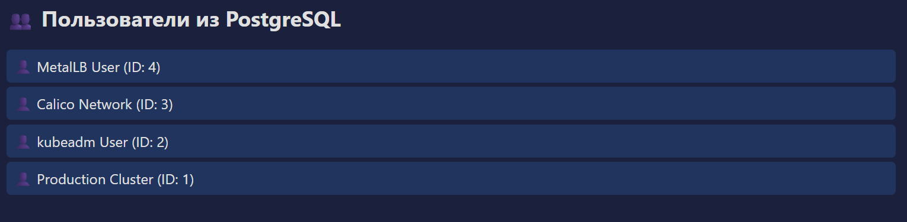

### 8. Тестирование отказоустойчивости
#### 8.1 Симуляция отказа узла

Временная остановка kubelet -worker1
systemctl stop kubelet
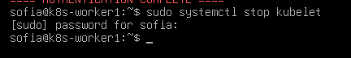

Наблюдение за статусом узла
kubectl get nodes -w
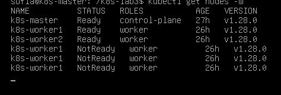

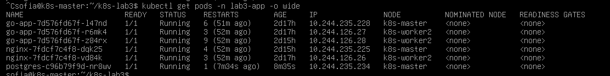

Включаем обратно -worker1
systemctl start kubelet

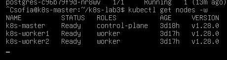

Все и так работает, так что не вернет под
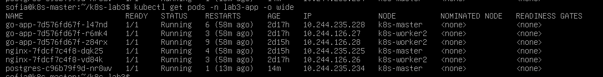

#### 8.2 Проверка сохранности данных
вывод команды 
[вывод команды SQL-запроса после перезапуска PostgreSQL]

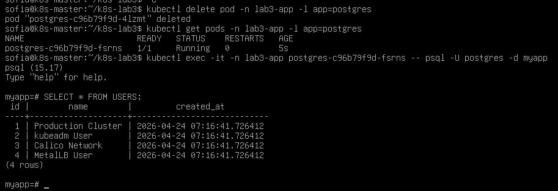

### 9. Ответы на контрольные вопросы
1. Компоненты Control Plane и их роль  
Control Plane (слой управления) — это совокупность компонентов, обеспечивающих поддержание желаемого состояния кластера (Desired State), он  управляет кластером, принимает решения, планирует поды, следит за состоянием.

Компоненты:

kube-apiserver: Центральная точка входа. Все команды (kubectl, контроллеры, ноды) общаются только через API Server. Управляет валидацией запросов, авторизацией, записью в etcd (Является единственным компонентом, взаимодействующим с хранилищем etcd)

etcd: Распределенное хранилище формата «ключ-значение», хранит всё состояние кластера: поды, ноды, конфиги, секреты, сервисы.

kube-scheduler: Компонент, отвечающий за распределение нагрузки. На основе алгоритмов фильтрации и оценки выбирает наиболее подходящий рабочий узел (Node) для размещения вновь созданных подов, учитывая требования к ресурсам и ограничения (affinities/taints).

kube-controller-manager: Агрегатор контроллеров, отвечающих за поддержание логики ресурсов, следит за отклонением текущего состояния от целевого и инициирует корректирующие действия.Набор контроллеров. Cледит, чтобы фактическое состояние совпадало с желаемым (ReplicaSet, NodeController, JobController и др.).

cloud-controller-manager: Обеспечивает интеграцию с API облачных провайдеров (управление маршрутами, балансировщиками и дисками).

2. Отличия kubeadm от Minikube  
Minikube: Инструмент для локальной разработки  Он запускает весь кластер (и мастер, и воркеры) внутри одной виртуальной машины или Docker-контейнера. Это «песочница», которая скрывает многие сложности настройки сети и безопасности.

Kubeadm: Это стандартный инструмент для создания полноценных (многоузловых) кластеров на реальном железе или виртуальных машинах. Он выполняет базовую настройку (сертификаты, токены, компоненты Control Plane), но оставляет настройку сети (CNI) и хранилища на усмотрение администратора. Это максимально приближенный к продакшену способ развертывания.

3. Назначение CNI-плагина и роль Calico  
CNI (Container Network Interface) — это стандарт, который позволяет Kubernetes подключать различные сетевые решения.Без него поды не смогли бы общаться друг с другом, так как Kubernetes сам по себе не умеет настраивать виртуальные мосты и маршруты на сетевом уровне.

Роль Calico: Это один из самых популярных CNI-плагинов. Он обеспечивает cетевую связность: каждому поду выделяется уникальный IP-адрес внутри кластера. Также реализует фаерволы и маршрутизацию.

4. Различия Service типа NodePort, LoadBalancer и Ingress  
Это три уровня доступа к приложению извне.

NodePort: Открывает определенный порт на всех узлах кластера. Трафик идет по схеме: IP_узла:Порт. Это самый простой, но не очень безопасный и гибкий способ.

LoadBalancer: Создает внешний балансировщик. В нашей лабораторной работе эту роль выполнял MetalLB. Он выделяет реальный IP-адрес из локальной сети (например, .101), который перенаправляет трафик на внутренние поды.

Ingress: Это умный прокси (обычно Nginx). Он работает на уровне HTTP и позволяет использовать доменные имена и пути (например, myapp.com/api — в один сервис, а myapp.com/web — в другой). Для его работы нужен Service (обычно NodePort или LoadBalancer), который примет трафик и передаст его Ingress-контроллеру.

5. Как обеспечивается отказоустойчивость control plane?  
По умолчанию, в минимальной конфигурации ( как в нашей лабораторной ) реализует минимальную отказоутойчивость . В стандартной установке (даже на одном мастере, как у нас) реализует автоматический перезапуск контроллеров: внутренние циклы управления постоянно сверяют текущее состояние с эталонным. Если один из потоков контроллера завершается с ошибкой, kube-controller-manager инициализирует его заново. Это следствие концепции статических подов -- основные компоненты (API-сервер, планировщик, контроллер) запускаются самим kubelet напрямую. Если процесс падает или зависает, kubelet автоматически перезапускает соответствующий контейнер.

### 10. Выводы

После самостоятельной сборки кластера была прочуствована разница между этим приципом и скрытыми настройками minikube. Основные проблемы - сетевые настройки (выделение корректных ip, свзяь с host и настройка как рабочей машины так и виртуальных машин), жизненный цикл пода Postgres. Столкновение со статусом Pending у базы данных при отключении узла выявило проблему неявной привязки локальных томов (localPath). Стало очевидным, что без использования динамических провижионеров или сетевых хранилищ, Kubernetes блокирует перемещение стейтфул-приложений (баз данных) ради сохранности целостности данных. Для иллюстрации работы при отключении текущими методами без перехода на др. технологии пришлось нарушить принципы разделения ответственности и единой точки отказа и перенести postgres на master-node.
