# Отчет по практической работе №1
## Студент: Нечаева Софья
## Группа: БСБо-16-23
## Дата выполнения: 07.03
### 1. Выполненные команды Docker
#### 1.1 Работа с образами

Поиск образов в Docker Hub и Скачивание образа
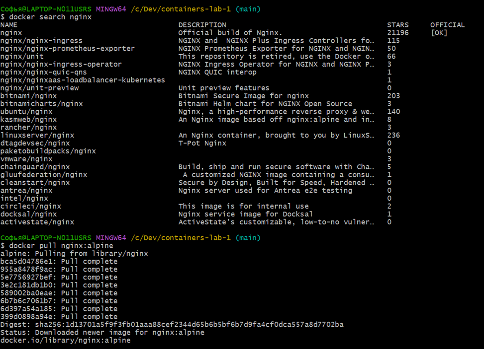

Просмотр локальных образов
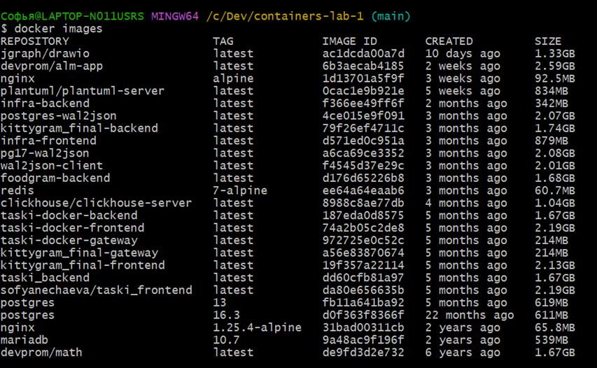

Просмотр истории слоев образа
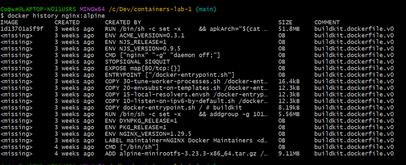

Удаление образа
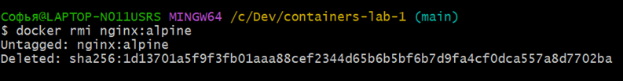

Практическое задание: Найдите образ PostgreSQL версии 15 и golang
версии 1.21 с минимальным размером (alpine), скачайте его и сохраните
вывод команды в отчете. 
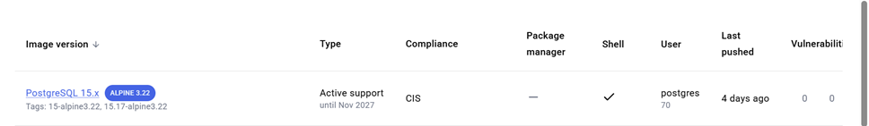
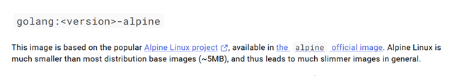

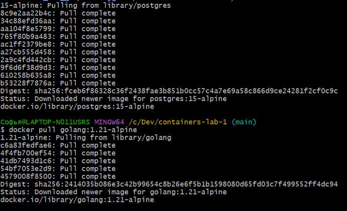

15-alpine: Pulling from library/postgres
8c9e2aa22b4c: Pull complete
34c88efd36aa: Pull complete
aa104f8e5799: Pull complete
765f80b9a483: Pull complete
ac1ff2379be8: Pull complete
a27cb555d458: Pull complete
2a9c4fd442cb: Pull complete
9f6d6f38d9d3: Pull complete
610258b635a8: Pull complete
b53228f7876a: Pull complete
Digest: sha256:fceb6f86328c36f2438fae3b851b0cc57c4a7e69a58c866d9ce24281f2cf0c9c
Status: Downloaded newer image for postgres:15-alpine
docker.io/library/postgres:15-alpine

Софья@LAPTOP-N011USRS MINGW64 /c/Dev/containers-lab-1 (main)
$ docker pull golang:1.21-alpine
1.21-alpine: Pulling from library/golang
c6a83fedfae6: Pull complete
4f4fb700ef54: Pull complete
41db7493d1c6: Pull complete
54bf7053e2d9: Pull complete
4579008f8500: Pull complete
Digest: sha256:2414035b086e3c42b99654c8b26e6f5b1b1598080d65fd03c7f499552ff4dc94
Status: Downloaded newer image for golang:1.21-alpine
docker.io/library/golang:1.21-alpine

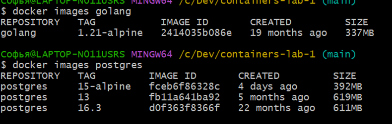
#### 1.2 Работа с контейнерами

Задание 2.2.1: Запустите и управляйте контейнерами
Запуск контейнера alpine в интерактивном режиме
 
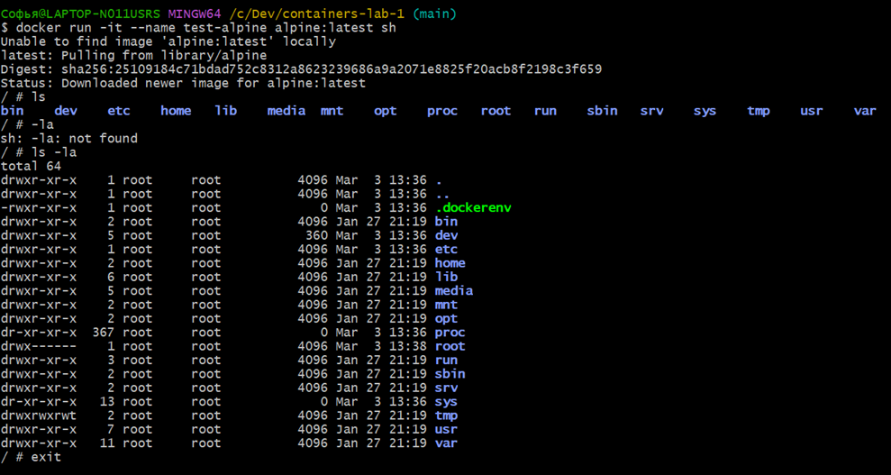

Запуск контейнера в фоновом режиме

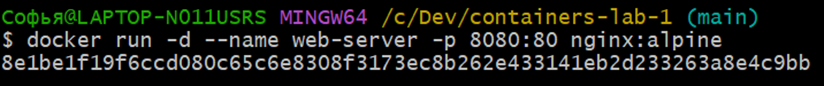
 
Просмотр запущенных и остановленных контейнеров

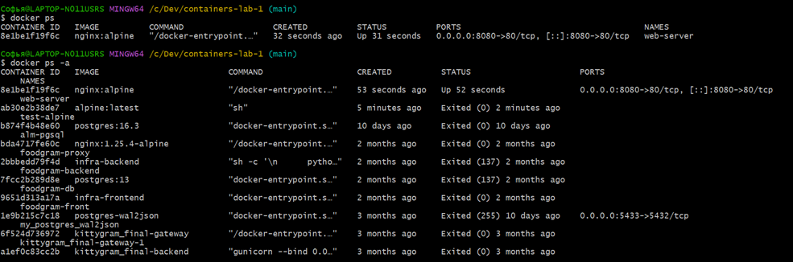
 
Просмотр логов контейнера

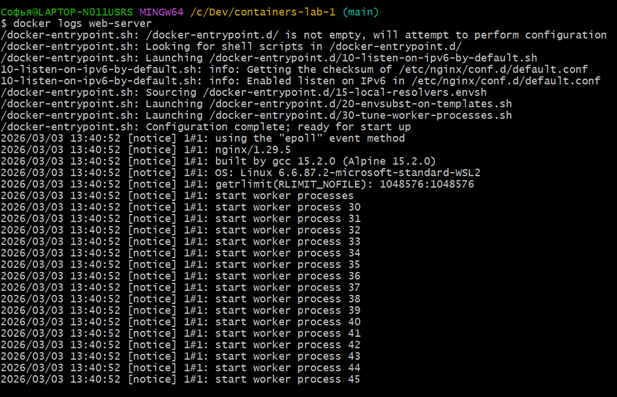
 
Подключение к работающему контейнеру

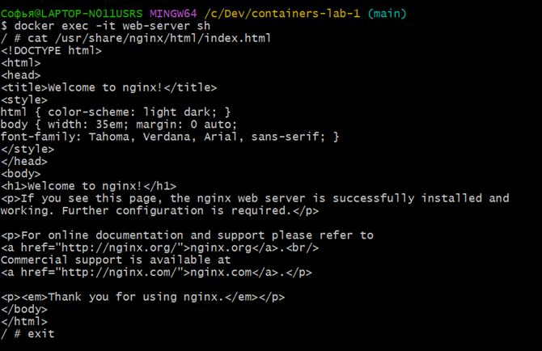
 
Остановка  и запуск контейнера

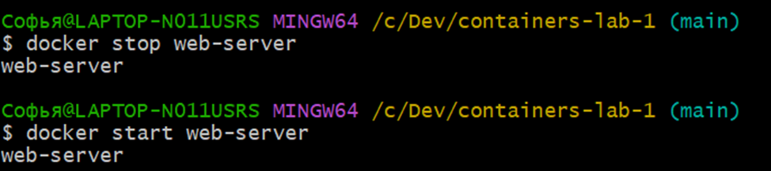
 
Практическое задание: запустите контейнер с PostgreSQL, задав пароль через переменную окружения, подключитесь к нему с помощью docker exec и выполните SQL-запрос SELECT version(); с помощью утилиты psql.

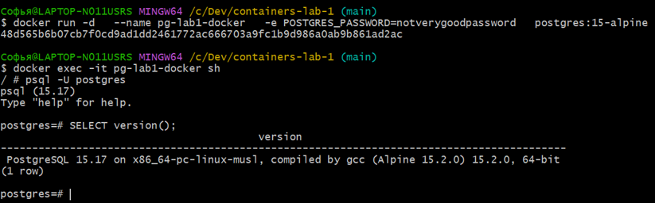
 
$ docker run -d   --name pg-lab1-docker   -e POSTGRES_PASSWORD=notverygoodpassword   postgres:15-alpine
48d565b6b07cb7f0cd9ad1dd2461772ac666703a9fc1b9d986a0ab9b861ad2ac

Софья@LAPTOP-N011USRS MINGW64 /c/Dev/containers-lab-1 (main)
$ docker exec -it pg-lab1-docker sh
/ # psql -U postgres
psql (15.17)
Type "help" for help.

postgres=# SELECT version();
                                         version
--------------------------------------------------------------------------------------
 PostgreSQL 15.17 on x86_64-pc-linux-musl, compiled by gcc (Alpine 15.2.0) 15.2.0, 64-bit
(1 row)

#### 1.3 Работа с томами

Задание 2.3.1: Сохраните данные вне контейнера
Создание именованного тома и информация о томе

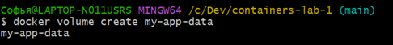

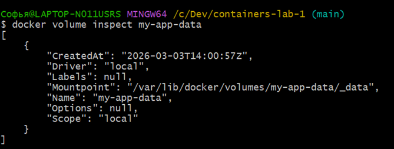

Просмотр томов

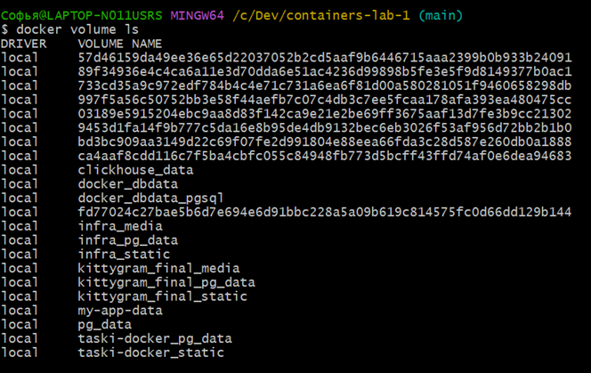
 
Запуск контейнера с томом

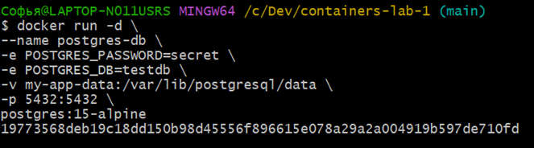
 
Создание тестовой таблицы

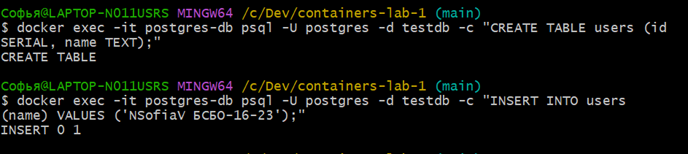
 
Остановка и удаление контейнера (данные сохранятся в томе)

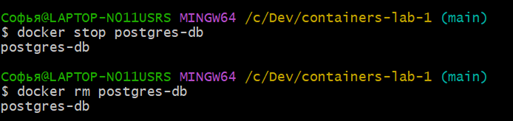
 
Запуск нового контейнера с тем же томом и проверка того, что данные сохранились

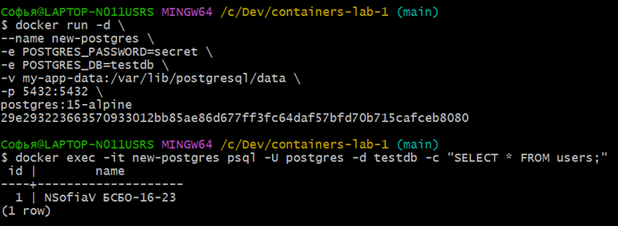
 
Практическое задание : Создайте том для статических файлов, запустите Nginx с примонтированным томом, скопируйте в него файл index.html с помощью docker cp по пути внутри контейнера /usr/share/nginx/html и проверьте доступность страницы в браузере.
 
 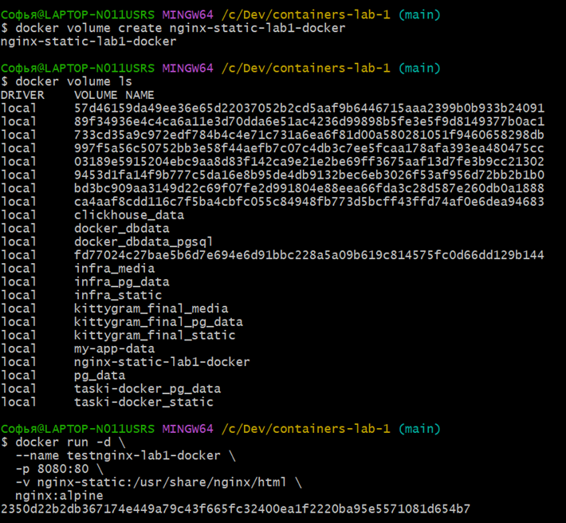

 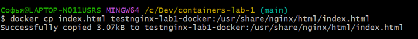

 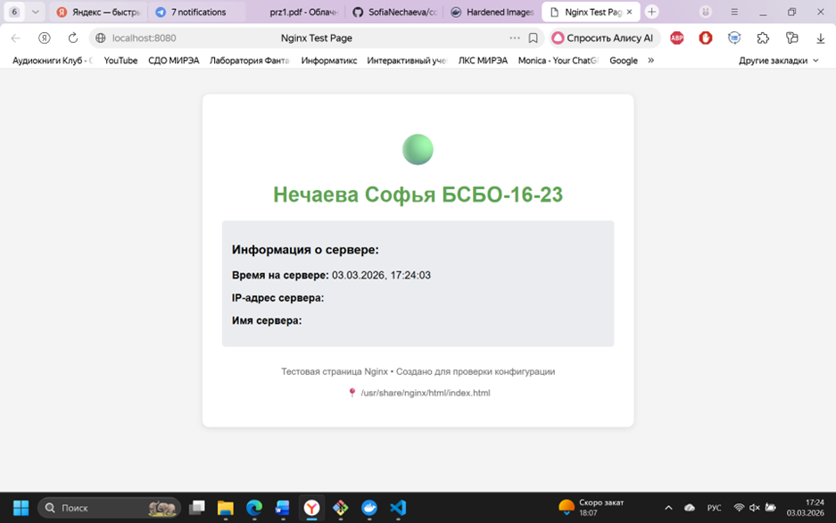

1.4 Сеть в Docker

Задание 2.4.1: Создайте изолированную сеть для взаимодействия контейнеров

Создание сети. Просмотр сетей. Запуск контейнеров в одной сети. 

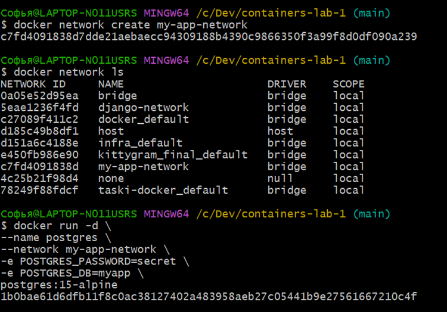

Проверка связи между контейнерами

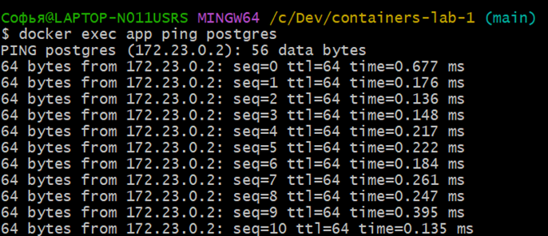
 
Практическое задание: Создайте сеть типа bridge, запустите в ней два контейнера (Nginx и PostgreSQL), проверьте их взаимодействие по именам контейнеров (можно сделать ping из контейнера к другому контейнеру через docker exec).

Софья@LAPTOP-N011USRS MINGW64 /c/Dev/containers-lab-1 (main)
$ docker run -d \
  --name nginx-lab1-docker \
  --network testbridge-network \
  nginx:alpine
dcf0c1416479a04599b89b2981ba2f6a9970a9ba2df1f4bb96568db54de34d1a
Софья@LAPTOP-N011USRS MINGW64 /c/Dev/containers-lab-1 (main)
$ docker run -d \
  --name postgres-lab1-docker \
  --network testbridge-network \
  -e POSTGRES_PASSWORD=secret \
  postgres:15-alpine
43b100ea048067c9ca22925840c1186dea706183d4684d4993e03d96a0e457ca

Софья@LAPTOP-N011USRS MINGW64 /c/Dev/containers-lab-1 (main)
$ docker exec nginx-lab1-docker ping postgres-lab1-docker
PING postgres-lab1-docker (172.24.0.2): 56 data bytes
64 bytes from 172.24.0.2: seq=0 ttl=64 time=0.510 ms
64 bytes from 172.24.0.2: seq=1 ttl=64 time=0.302 ms
64 bytes from 172.24.0.2: seq=2 ttl=64 time=0.138 ms
64 bytes from 172.24.0.2: seq=3 ttl=64 time=0.134 ms
64 bytes from 172.24.0.2: seq=4 ttl=64 time=0.303 ms

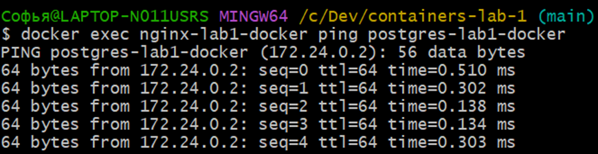

### 2. Скриншоты работающего приложения
#### 2.1 Главная страница
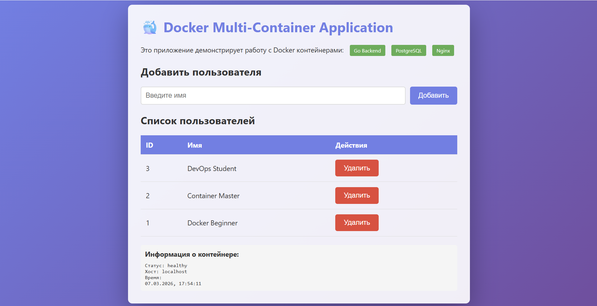
#### 2.2 Добавление пользователя
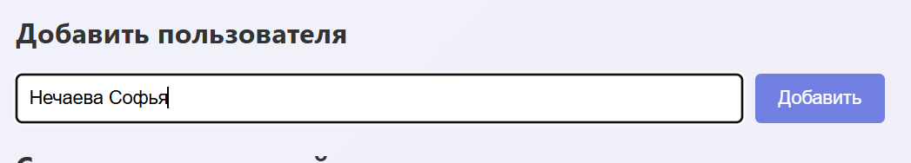

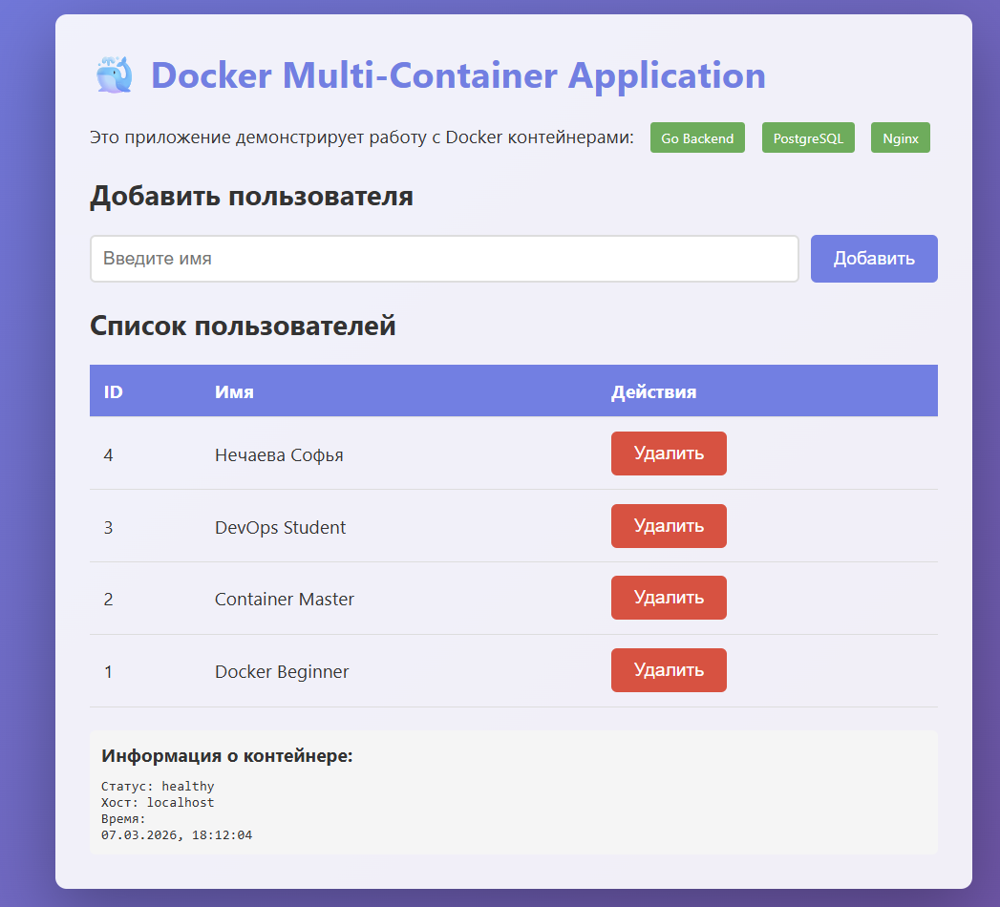

#### 2.3 Список пользователей в БД
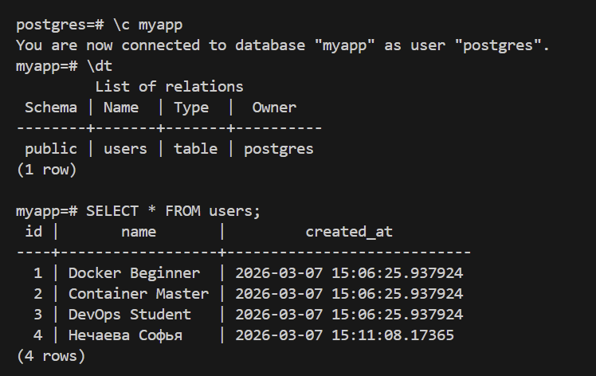
### 3. GitHub Actions
#### 3.1 Успешный запуск workflow
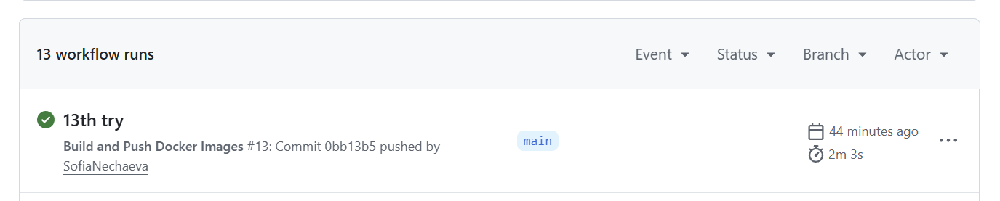
#### 3.2 Опубликованные образы
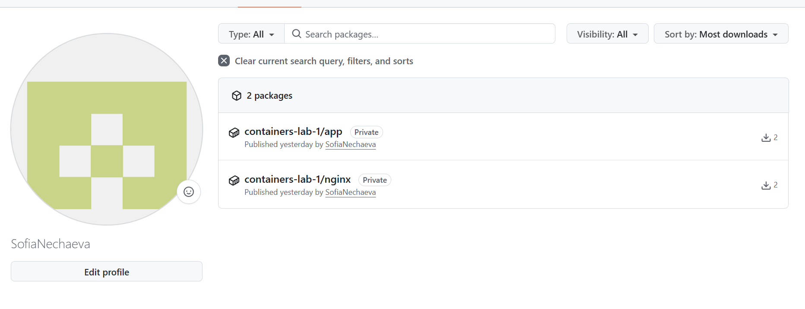
### 4. Выводы
Попрактиковала и повторила команды, используемые для работы с котейнерами. Столкнулась с трудностями при сведении в одну работующую систему несколько конейнеров, составивших в результате приложение. Изучила команды github actions